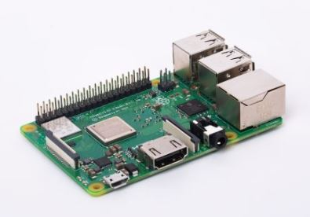
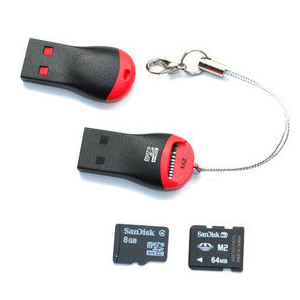
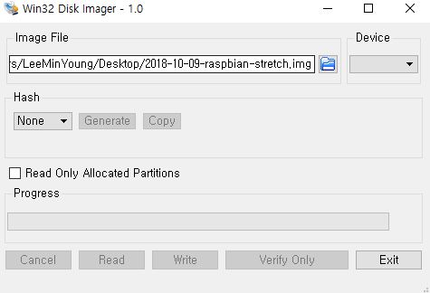
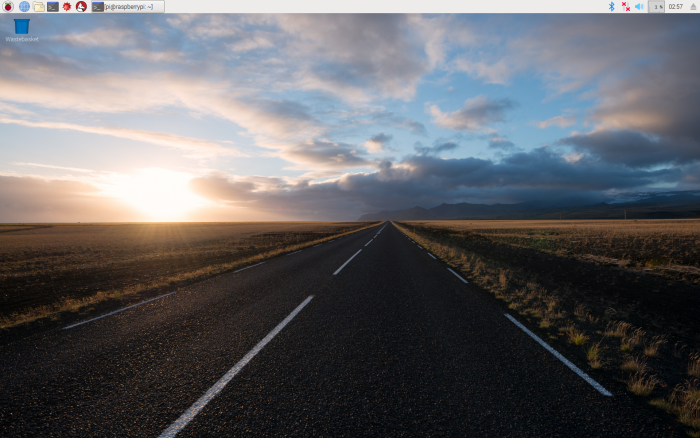

# raspberryPi_OS_Install
## 라즈비안 설치

### 1. 사전준비
1) 라즈베리파이 3B+

2) MicroSD카드, 리더기 (SD카드는 OpenCV설치 및 Yolo사용을 위해 16GB 이상을 선택했습니다)

### 2. OS설치

1) https://www.raspberrypi.org/downloads/raspbian/ 에 접속하여 zip파일을 다운 받는다.

2) https://sourceforge.net/projects/win32diskimager/ 에 접속하여 Win32 Disk Imager를 다운 받는다.
설치가 완료되면 Image File의 폴더 아이콘을 클릭하여 다운받았던 라즈비안 파일을 선택하고
Device의 SD카드 드라이브를 선택하고 write버튼을 누른다.

3) 실행
설치된 SD카드를 라즈베리파이에 넣고 부팅 시키면 실행화면을 볼 수 있습니다.

