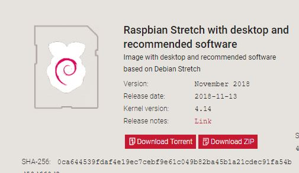

# raspberryPi_OS_Install
## 라즈비안 설치

### 1. 사전준비
1) 라즈베리파이 3B+

2) MicroSD카드, 리더기 (SD카드는 OpenCV설치 및 Yolo사용을 위해 16GB 이상을 선택했습니다)

### 2. OS설치

1) https://www.raspberrypi.org/downloads/raspbian/ 에 접속하여 zip파일을 다운 받는다.

